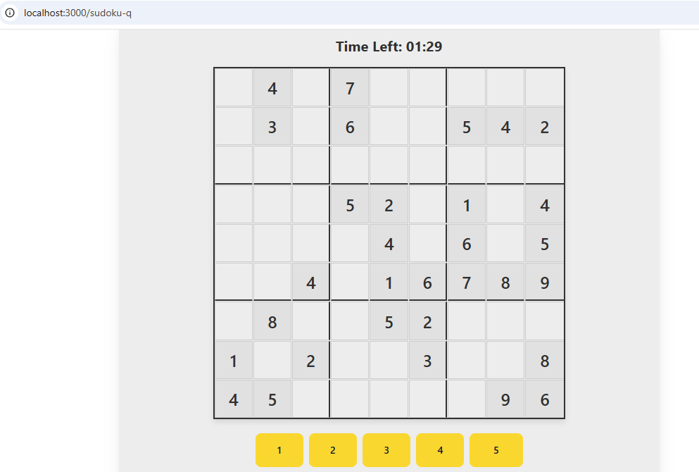
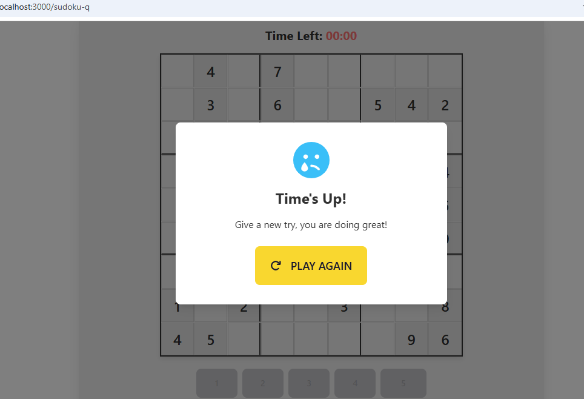

# Sudoku Q

A fun Sudoku game built with React and DaisyUI, featuring a 3-minute timer challenge.

## Screenshots




## Features

- Interactive Sudoku board with 3 difficulty levels
- 3-minute timer to challenge your Sudoku skills
- Beautiful UI using DaisyUI with the Bumblebee theme
- Responsive design for desktop and mobile play
- GitHub Pages deployment ready

## How to Play

1. Select a difficulty level (Easy, Medium, Hard)
2. Click on a cell to select it
3. Click a number from the number pad to fill the cell
4. Complete the Sudoku puzzle before the 3-minute timer runs out
5. If you complete the puzzle correctly, you'll see a congratulation message
6. If you run out of time, you'll be encouraged to try again

## Development

### Prerequisites

- Node.js and npm

### Installation

1. Clone the repository:
   ```
   git clone https://github.com/yourusername/sudoku-q.git
   cd sudoku-q
   ```

2. Install dependencies:
   ```
   npm install
   ```

3. Start the development server:
   ```
   npm start
   ```

4. Open [http://localhost:3000](http://localhost:3000) to view it in your browser.

### Deployment to GitHub Pages

1. Update the `homepage` field in `package.json` with your GitHub username:
   ```json
   "homepage": "https://yourusername.github.io/sudoku-q"
   ```

2. Deploy to GitHub Pages:
   ```
   npm run deploy
   ```

## Technologies Used

- React
- DaisyUI (Tailwind CSS-based component library)
- Font Awesome for icons
- GitHub Pages for deployment

## License

MIT

## Acknowledgements

- Created with React and DaisyUI
- Favicon and UI design inspired by classic Sudoku games
